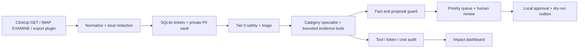

# Matiks support workbench

Local **dry-run** support console for the [Matiks AI Hackathon](https://claude.ai/code/artifact/b57440dd-e116-4f35-a751-b8fd54b27a05).
The workbench imports tickets, applies safety rules, investigates through bounded read-only tools, checks drafts, ranks the queue, and records local approvals. It never sends a message or changes Matiks systems. A local sample of **679 real reports** was captured read-only on 2026-10-03: 413 ClickUp submissions, 66 support emails, and 200 in-app communication reports. These unlabelled snapshots, credentials, local databases and screenshots containing live reports **are not included in this repository**.

## Run on your machine

Prerequisites: [uv](https://docs.astral.sh/uv/getting-started/installation/), Git, and Node.js 22.12 or newer. Repository access is required because this project is private. macOS/Linux users can use `make`; the equivalent commands below also work without it.

```sh
git clone https://github.com/YashGargIND/matiks-support-agent.git
cd matiks-support-agent
make setup
make dev
```

Open **http://127.0.0.1:8508/**. `make dev` starts the React dashboard and API together, locks all action modes to `dry_run`, disables model calls, and stops both services with Ctrl+C. It does not ingest live channels automatically. A fresh clone starts with an empty local queue; no credentials are needed for the synthetic demo. Both ports, 8508 and 8517, must be free.

Without `make`:

```sh
uv sync --locked --extra data --python 3.12
cd frontend
npm ci
cd ..
uv run python scripts/dev.py
```

Keep services local. There is no multi-user authentication. Runtime data stays in the ignored `data/` directory. To connect live sources, copy `.env.example` to `.env` and supply your own authorized credentials; never copy the project owner's populated environment files into Git. Machine-specific paths such as `REPO_PATH` must be changed for your checkout.

The older Streamlit console is separate: `uv run matiks-support run` ingests configured channels, processes up to 20 open tickets and opens port 8507. Use the React launcher above for the hackathon demo.

## Demo the first four flows

The agreed priority is **DM safety → merchandise reply → streak restoration → feature request**, followed by bug investigation and cheating reports. In the Inbox, choose **New report**, check **Demo example**, select a preset scenario, and enter your name. The synthetic queue is separate from real metrics. Open the new ticket and choose **Investigate**, then review its evidence and checked draft.

| Preset | Expected result | Review boundary |
| --- | --- | --- |
| DM safety: review evidence | Scoped fictional chat supports a temporary messaging-ban proposal | Human reviews internal proposal separately from the reporter reply; fixture range 7–30 days is labelled demo-only |
| Merch: historical delivery reply | Five fictional delivered orders produce median 8 days and p90 10 days | Checked historical estimate, without a delivery guarantee |
| Streak: suggested restore | Disputed-day activity supports a proposed restoration to 214 days | Human approves the local restoration proposal; no account is changed |
| Feature: capture demand | Suggestion recorded with a safe acknowledgment | No shipping promise or invented product owner |

Edge presets also exercise critical DM escalation, delayed merch, incomplete streak evidence, and a fictional paid-restore offer of **250 demo credits**. That price is not a Matiks policy. Preset evidence is registered locally and cannot be selected by arbitrary ticket text or leak into a real report.

Use **New report** without the demo checkbox to test a real report with your configured read-only sources. Missing chat access, historical inventory, delivery semantics or approved policies causes an explicit human-review outcome. Live DM chat reads require the moderation admin API token; the client/server environment files do not supply a logged-in admin session.

```sh
make demo-check
```

These tests exercise the first four API flows, stale review protection, action/reply separation, edge outcomes and fixed moderation reads. They use synthetic evidence and make no external calls.

## Work with the team

Clone the private repository, create a branch, make a focused change, run `make check`, and open a pull request. Keep credentials and source exports on your machine. Review generated OpenAPI types after changing the API: with the local API running, use `cd frontend && npm run api:types`. GitHub Actions runs the locked Python environment, tests, secret-file checks, lint and the frontend production build without credentials.

The repository owner must invite teammates using their GitHub handles. A private URL alone does not grant access. Milestone commits are pushed after validation; unfinished local edits may be newer than the latest shared checkpoint.

The [progress Site](https://matiks-support-progress.yashgarg.chatgpt.site) is private. A sanitized, shareable checkpoint is included in [progress/status.json](progress/status.json); it distinguishes synthetic demo checks from live validation and lists remaining blockers.

## Connect real sources

Set secrets in the ignored `.env`; never paste credentials in chat or commit them.
Enable these entries in `config.yaml`:

```yaml
channels:
  - support.channels.clickup:ClickUpAdapter
  - support.channels.email:EmailAdapter
```

ClickUp uses only the list-tasks GET endpoint. The verified `feedbacks` list ID is `901611930428`; its email/username/topic field IDs are mapped in `config.yaml`. Creator identity is not treated as the reporting user. Other lists require their own verified field map. The adapter requests oldest-first ordering, fails closed if the response order differs, and checkpoints same-timestamp pages without skipping reports. It currently requires the configured 100-task ingestion cap. The connected ClickUp app's 100-call daily allowance was exhausted during discovery on 2026-10-03; continuous polling needs your own scoped API configuration or fresh exports.

To import from the dashboard, configure `CLICKUP_API_TOKEN` and `CLICKUP_LIST_ID` in your local `.env`, restart the support server, and open **Settings → Channels → ClickUp → Sync reports**. Enter your name for the local audit record. Each sync reads up to 100 **open** reports, starting within the initial seven-day window and then continuing from the saved checkpoint. Repeat while the dashboard indicates more reports may remain. The result shows fetched and newly added counts; duplicates are skipped. Sync only imports reports for review and does not investigate them, send replies or update ClickUp.

Email uses TLS IMAP, Google OAuth or an app password, `readonly=True` (EXAMINE), UID checkpoints and BODY.PEEK. It reads only the configured folder, applies a bounded initial lookback and exact support-addressed To/Cc checks, caps each fetch and does not change unread flags. Stable Gmail message identifiers prevent duplication with captured Gmail snapshots. OAuth access tokens remain in memory; the existing full-mail grant is used exclusively for these read operations.

Local export format (JSON list or CSV columns): `channel`, `channel_ref`, timezone-bearing `created_at`, `subject`, `body`, optional `user_identifier`, `known_names`, `provenance`. Real exports default to `provenance=real`; synthetic tests must use `synthetic`.

The initial capture used `ClickUpSnapshot` and `GmailSnapshot` through connected apps. The local queue was extended through the read-only ClickUp adapter and in-app report collection. Gmail was scoped to support-addressed messages from the previous seven days, reads plain text, omits attachments and transport headers, and trims common quoted replies. These are bounded samples, not the full backlog. A subsequent IMAP check found no new message passing the exact To/Cc filter.

```sh
.venv/bin/matiks-support import /absolute/path/to/real-ticket-export.json
.venv/bin/matiks-support process
```

## Architecture



The OpenAI Agents SDK is pinned to **0.23.1**; `uv.lock` pins the complete environment. Models use explicit `OpenAIChatCompletionsModel` instances with OpenRouter's endpoint, `require_parameters=true`, `data_collection=deny`, typed outputs, blocking injection guards and output guards. Model calls are disabled by default. Configure the role models in `config.yaml`, then enable `LLM_ENABLED` after supplying an OpenRouter key and reviewing redacted real ticket input.

A live synthetic SDK/OpenRouter check passed on 2026-10-03 with `openai/gpt-4.1-mini`: one local tool invocation, two model calls, strict structured output, tracing disabled, no real ticket text, and provider-reported cost **$0.000174**. The first attempt failed with HTTP 404 because the requested `parallel_tool_calls` parameter is not advertised by the verified model endpoints. That parameter was removed; the failed attempt remains in the audit, with its cost reconciled against authenticated zero lifetime/daily/monthly usage for the unchanged key. Other configured role models and real-ticket investigations still require separate validation. The synthetic check can be repeated with `.venv/bin/python -m support.smoke`; it uses the normal cost ledger and a child-process-only model flag.

The orchestration owns deterministic routing. Categories: account, feature, gameplay bugs, app bugs, streak, purchase, DM safety, cheating, merch, other. Specialists share a constrained tool interface and return typed investigation results. Critical safety goes directly to human review without model judgment. Unconfigured data tools return an auditable unavailable result; they never invent database fields or account facts.

## Safety and facts

- `SEND_MODE`, `ACTION_MODE`, and `SLACK_POST_MODE` must all be `dry_run`. Any other value raises. There is no real dispatcher.
- Every action type writes only to `proposed_actions`; approval writes only to the local `outbox`. Reply and internal-action approval are separate. Internal approval recomputes the branch decision from current evidence and policy and rejects stale or modified proposals.
- PII regex/known-name redaction keeps reversible mappings locally. Database permissions restrict access. Regex cannot detect arbitrary names/addresses reliably; real ticket model calls require human review. Tool-output privacy must be verified before connecting a live provider.
- SDK tracing and model/tool payload debug logs are disabled before import. Local logs retain metadata and redacted evidence, not raw provider exceptions.
- Ticket text is untrusted. It cannot authorize a restore or provide proof of a purchase/shield.
- Only verified facts with a source and a valid, non-future verification timestamp can support answers. The console includes a validated YAML editor and records reviewer/change metadata. The reported usual messaging-ban range is 7–30 days, but severity-specific approved policies, paid streak-restore eligibility/pricing and `completed` merchandise status semantics remain unsettled. Demo-only facts are scoped to registered synthetic cases.
- The output guard accepts exact approved wording, safe acknowledgments, and independently recomputed specialist templates. Approved wording needs its matching category, language and policy reference. Model-authored internal proposals must match a computed branch decision. Arbitrary factual paraphrases remain withheld pending semantic checking. Completed-action claims and false promises are blocked even in human-edited drafts.
- Evidence references are bound to the current ticket and run. Unknown, stale and unavailable evidence cannot support proposals.
- All model calls, including failures, record tokens/cost when available. Missing cost is **unknown**, never zero. No model retries are hidden in the provider client. Unknown accounting blocks subsequent model calls until reconciled. The daily budget check stops new calls once reached; a final in-flight call can cross the threshold.

## Metrics

The dashboard separates open, draft-ready, locally resolved, escalated and closed tickets. **Resolved** means a safe checked auto draft or a human-approved draft/internal proposal. Auto-resolution is limited to recorded feature acknowledgments, verified account instructions and merchandise within an evidence-backed delivery window. No reply is actually sent; replied-to-real-user count is always zero. A zero model bill from the current rules-only run is not a measurement of live model cost.

Arrival-to-resolution, ingest-to-draft, ingest-to-resolution and human handling time are distinct. Historical queue age is not claimed as AI runtime. Manual/assisted handling samples include their sizes and are not a controlled comparison without matched tickets. Cost per resolved ticket is absent until there are resolved tickets. Synthetic cases are excluded from the default dashboard.

Unknown cohort values remain null and are not guessed from ticket text. Safety ranks above paying/power cohorts. Verified paying and 100+ day streak users get explicit score reasons.

## Evidence integrations and specialist decisions

```sh
UV_CACHE_DIR=/private/tmp/matiks-support-uv uv sync --locked --extra data --python 3.12
.venv/bin/matiks-support inspect-schema
```

Mongo requires authenticated built-in read roles, an explicitly selected database and payment database, minimal field projections and bounded queries. `source_map.yaml` is derived from local Matiks source. The project owner's nine collection aliases and core BSON identifier fields were checked live; each teammate must inspect their own selected database before setting `MONGO_SCHEMA_VERIFIED=true`. The inspection command returns collection/index/type metadata without sample values. Connections close after investigation. There are no writes, migrations or arbitrary query tools. An empty bounded payment lookup remains unknown rather than proving nonpayment.

- Streak: `bug_confirmed` proposes a free restoration from disputed-day proof and verified prior streak; `not_a_bug` requires complete history and log coverage before offering a verified paid option; `data_unclear` escalates. Current shield stock does not prove stock at the incident. The live Mongo snapshot currently lacks historical inventory/settings and therefore cannot by itself justify restoration.
- Merch: requires one unambiguous confirmed order and matching delivered samples. Calculates mean/median/nearest-rank p90, deduplicates orders, excludes future/negative intervals, and requires at least five samples. Age beyond p90 proposes vendor review. A vendor's `completed` status is not assumed to mean delivery; an approved semantics policy is required. Cake capture rows are not assumed to be orders.
- Account: verified identity and matching login-method policy can support a how-to draft. Deletion instructions additionally require a verified requesting contact. No deletion action exists.
- Purchases: read evidence and always escalate. No refund or team-activity claim is invented.
- DM safety: critical keywords bypass models and go to human review. Noncritical cases require scoped excerpts, verified violation/severity, and matching approved policy/config band. Proposes the band's lower duration for human review; no ban is executed or disclosed to the reporter.
- Cheating: requires a scoped, complete population comparison with at least 20 baseline samples. Anomalies propose a human flag; they are not a cheating verdict or ban.
- Feature: records and acknowledges the suggestion locally without a shipping promise. Similar-ticket demand appears in Problems; verified product-owner routing still needs implementation.
- Gameplay/app bugs: the repository provider gathers bounded tracked-file excerpts, commit context and supported CODEOWNERS matches. These are local working-tree findings, not proof of deployment or runtime cause. The current global engineering-review team is not treated as a product owner. Deep RCA and patch generation remain pending.

In-app DM report ingestion reads pending communication reports in bounded seven-day batches without updates. Chat evidence uses only the existing fixed `getAdminConversationHistory` admin GraphQL query, through the moderation API; it does not decrypt database content locally or execute mutations. Live decrypted chat access is pending a valid `MATIKS_ADMIN_READ_TOKEN`. Readable messages alone do not constitute a verified severity verdict. Cheating population evidence and GCP log query structure/coverage are not yet verified. Slack proposals remain local with external dispatch disabled.

## Add a channel in five minutes

Create one file defining a `ChannelAdapter` subclass with a unique `name`, bounded `fetch_new(since)` and an adapter-specific `cursor(raw)` if needed. Return `RawMessage` objects. Add one `module:Class` entry to `config.yaml`. No pipeline change is required. `write_back` is permanently disabled; use local proposals.

The provided `support.channels.file:FileAdapter` reads JSON/CSV exports. Set `SUPPORT_IMPORT_PATH` in `.env` and enable the plugin for an on-stage channel demo. Exports must be appended in timestamp/source-key order or imported with a fresh checkpoint; old-dated new rows otherwise require resetting the local file checkpoint.

## Verify

```sh
.venv/bin/pytest -q
.venv/bin/ruff check .
.venv/bin/ruff format --check .
cd frontend && npm run build
```

Tests cover every action type's dry-run boundary, stale/missing evidence, injection, critical safety, cohort priority, false promises, private mappings, duplicate ingestion, same-timestamp pagination, approval idempotency/concurrency, cost unknowns, API flow and the installed SDK's actual tool/guard interfaces. SDK transport tests use a local mock; they do not call a model or transmit tickets.

The initial shared checkpoint passed **124 Python tests**, Ruff checks and the frontend production build. Synthetic browser checks covered the first four demo flows. Live-source and human acceptance gaps remain listed below and in the progress checkpoint.

The ClickUp dashboard-sync checkpoint passed **134 Python tests**, Ruff and the frontend build. A browser check confirmed the enabled sync control and fetched/added feedback; live read-only batches and a final repeat verified checkpoint continuation and duplicate skipping.

The [evaluation guide](evals/README.md) explains reviewed labels and isolated snapshot runs. The owner's ignored `data/label_candidates.json` holds an earlier 80-report subset with null outcome labels; the newer local queue has 679 real reports. Neither proves labelled accuracy until reviewed. The checked-in smoke dataset is synthetic and clearly reported as such.

## Remaining deliverables

The first four demo paths have synthetic end-to-end coverage through the production pipeline and local review guards. Live Mongo roles/core schema, ClickUp reads and IMAP OAuth reads have been verified on the owner's machine. The React dashboard and a synthetic live SDK/OpenRouter smoke are available. Remaining work includes approved policy details, live admin chat authentication and severity review, complete historical streak evidence, GCP/cheating evidence, real-ticket model validation, deeper RCA/patch proposals, verified PM routing, semantic claim checking, reviewed real-ticket evaluation, matched manual timing and the final demo/video. Bulk approvals and unsupported adapters are visibly unavailable. Missing-data escalations do not prove those investigations are complete.

SDK references checked on 2026-10-03: [SDK guide](https://developers.openai.com/api/docs/guides/agents/sdk), [0.23.1 release](https://github.com/openai/openai-agents-python/releases/tag/v0.23.1), [model integration](https://openai.github.io/openai-agents-python/models/), [tracing](https://openai.github.io/openai-agents-python/tracing/), [guardrails](https://openai.github.io/openai-agents-python/guardrails/), [OpenRouter structured outputs](https://openrouter.ai/docs/guides/features/structured-outputs), [OpenRouter usage](https://openrouter.ai/docs/cookbook/administration/usage-accounting).
